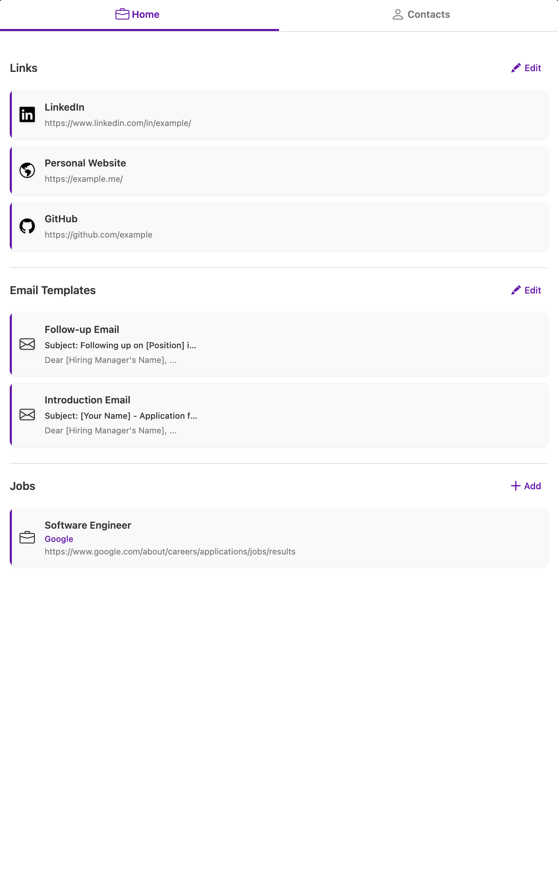

# JobAssist

A powerful Chrome extension that centralizes your job search process by organizing professional links, contacts, job listings, and email templates in one seamless interface.

## ✨ Features

### 🔗 Quick Links Management
- Store and organize your professional profile links (LinkedIn, GitHub, Portfolio, etc.)
- Add unlimited custom links with various preset types
- One-click copy functionality for easy sharing
- Fully customizable link titles and URLs

### 💼 Job Tracking
- Save job postings with title, employer, and URL information
- Auto-capture the current webpage URL when adding a new job
- Track application dates and status
- Quick-copy functionality for job details

### ✉️ Email Templates
- Pre-configured templates for follow-up and introduction emails
- Customizable subjects and bodies
- Quick copy functionality for efficient communication
- Perfect for consistent outreach to recruiters and hiring managers

### 👥 Contact Management
- Store networking contacts with comprehensive details
- LinkedIn integration for profile detection
- Quick email composition with Gmail integration
- Track outreach status with each contact

## 🚀 Installation

### From Chrome Web Store
1. Navigate to the [Chrome Web Store](https://chrome.google.com/webstore)
2. Search for "JobAssist"
3. Click "Add to Chrome"
4. The extension icon will appear in your browser toolbar

### Manual Installation (Developer Mode)
1. Download or clone this repository
2. Open Chrome and go to `chrome://extensions/`
3. Enable "Developer mode" in the top-right corner
4. Click "Load unpacked" and select the extension directory
5. The extension icon will appear in your browser toolbar

## 📖 Usage

### Managing Quick Links
1. Click the JobAssist icon in your browser toolbar
2. On the Home tab, find the Links section
3. Click "Edit" to manage your links
4. Add, modify, or remove links as needed
5. Click "Save" when finished

### Tracking Jobs
1. While on a job posting page, click the JobAssist icon
2. In the Jobs section, click the "+" button
3. The job title, employer, and URL fields are pre-filled when possible
4. Add any additional information
5. Click "Save" to store the job

### Using Email Templates
1. Click the JobAssist icon
2. On the Home tab, scroll to Email Templates
3. Click on a template to view the full content
4. Use the copy buttons to quickly use in your emails
5. Click "Edit" to customize your templates

### Managing Contacts
1. Click the JobAssist icon
2. Navigate to the Contacts tab
3. Click the "+" button to add a new contact
4. LinkedIn profiles automatically populate relevant fields
5. Toggle the "Reached Out" status to track your networking

## 🔒 Privacy & Data

All your data is stored locally in your browser using Chrome's storage API. No personal information is sent to external servers.

You can export your data at any time using the download buttons in the Jobs and Contacts sections.

## 🛠️ Permissions
- **storage**: Saves your data locally in your browser
- **tabs**: Accesses current tab URL for job and contact info
- **scripting**: Enables LinkedIn profile data extraction
- **host_permissions**: Provides LinkedIn and Gmail integration

## 💬 Support

Found a bug or have a feature request? Please [create an issue](https://github.com/abdullahmalik/jobassist/issues) on the GitHub repository.

## 📜 License

This project is licensed under the [MIT License](LICENSE).

## 👨‍💻 Author

Created by [Abdullah Malik](https://github.com/abdullahmalik)